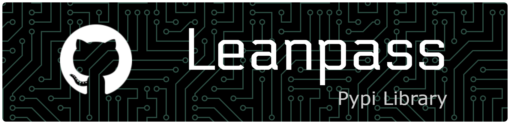

<!-- this banner was made by https://leviarista.github.io/github-profile-header-generator/, kindly do check it out -->


LeanPass is a lightweight, transparent NumPy-based autodiff library for small neural network experiments. It is designed to be easy to read, simple to inspect, and practical for learning how automatic differentiation works under the hood.

## Why LeanPass?

- Minimal dependency footprint: only NumPy
- Clear, readable implementation instead of heavy abstraction
- Core building blocks for tensors, layers, and optimizers
- Useful for teaching, prototyping, and small-scale experimentation

## Features

- Tensor objects with reverse-mode autodiff
- Core arithmetic and matrix operations
- Activation functions such as ReLU, sigmoid, and softmax
- Linear layers and multilayer perceptrons
- Loss utilities: `mse_loss`, `cross_entropy_loss`, and `binary_cross_entropy_loss`
- SGD and Adam optimizers
- A simple demo script that trains a toy model

## Installation

```bash
pip install leanpass
```

## Quick start

```python
from leanpass import Tensor, nn

x = Tensor([[1.0, 2.0]], requires_grad=False)
model = nn.MLP([2, 16, 3])
logits = model(x)
print(logits)
```

## Running the demo

```bash
python demo.py
```

## Repository layout

- leanpass/ — the package source code
- tests/ — regression and gradient-check tests
- demo.py — a small end-to-end example
- pyproject.toml — package metadata and build configuration
- CHANGELOG.md — release history and notable changes

## Development

To run the test suite:

```bash
pytest
```

## Community and contribution

- See [CONTRIBUTING.md](CONTRIBUTING.md) for contribution guidelines.
- See [SECURITY.md](SECURITY.md) for the vulnerability disclosure process.
- Bug reports and feature requests can be opened through the issue templates in [.github/ISSUE_TEMPLATE](.github/ISSUE_TEMPLATE).
- Pull requests should follow the template in [.github/PULL_REQUEST_TEMPLATE/pull_request_template.md](.github/PULL_REQUEST_TEMPLATE/pull_request_template.md).

## License

This project is licensed under the MIT License. See [LICENSE](LICENSE) for details.
